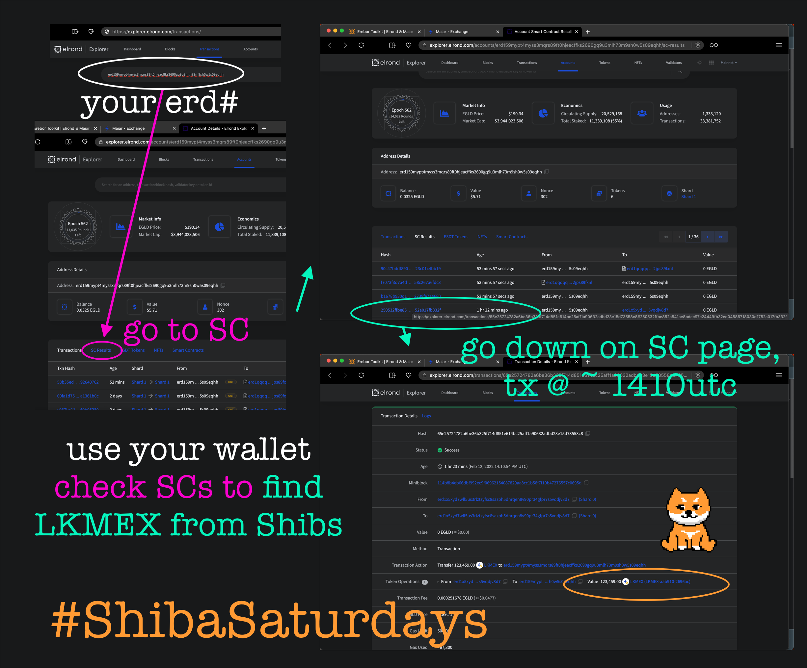

<figure>

<figcaption align="center">
14 Elrond Shibas in 2022Q1
</figcaption>
</figure>
# LKMEX & Passive Rewards

Elrond Shibas are amazing, right?? They bring you LKMEX every week (usually Shiba Saturdays) but what is LIKMEX and how to use it?

# LKMEX?

MEX is the Maiar Exchange token, and it becomes Egold directly if you wish. Locked (LKMEX) is a wrapped version of MEX that can't become Egold but stays MEX because it is time locked by blockchain enchantments. Moar on that later

LKMEX unlocks in 24 months but you can stake it like in other DeFi systems right in the Maiar exchange. 

If you stake it earns approx 100% apy moar LKMEX! Keep doing this a bit, and then the Option 2 of staking it for MEX looks good, bc you'll be able to start swapping out MEX for raw EGLD at this point!

[Go to the elrond Explorer](https://explorer.elrond.com) to find your LKMEX drops.

Here's a visual flow of what to do.
<figure>

<figcaption align="center">
Click on the SC section, it's far down the page.
Scroll down, look for the timestamp of the transaction.
CLick on the likely Elrond Shibas transaction. You'll see LKMEX tokens recevied (with a lot of metadata, too).
</figcaption>
</figure>

## [Join Maiar](https://get.maiar.com/referral/o6q0in3yh6) if you don't yet have Egold