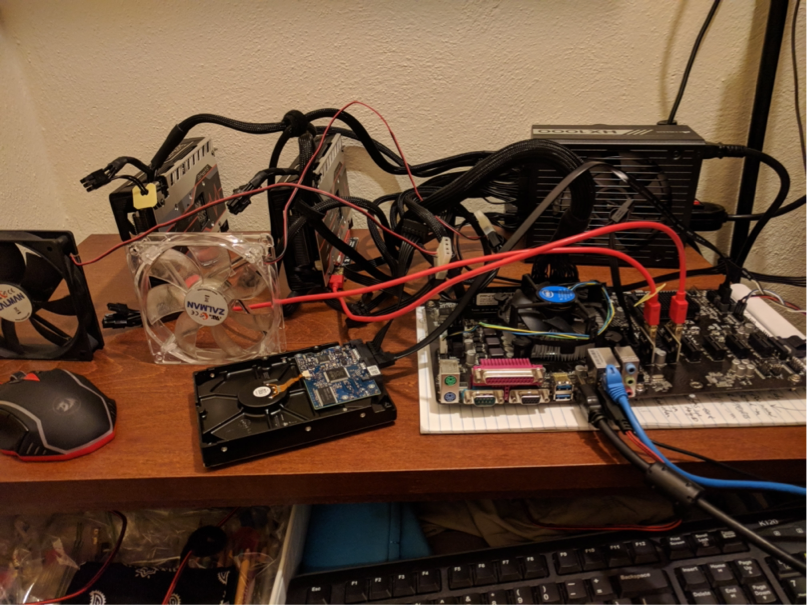

<figure>

<figcaption align="center">
I built a small crypto mining rig in 2017
</figcaption>
</figure>

# The Mining Situation
## [Current stats of RavenCoin Mine on nanopool](https://rvn.nanopool.org/account/RDhE9ZEEcRn38x5tQiYvv9gT7MXfwL82By)

Mining RavenCoin is not difficult to set up, and it works well even on gaming PCs because it's a democratic blockchain that doesn't work any better in big mines!

A crypto mining rig runs 24/7 and can help warm your apartment if it's in the right spot. (Pic forthcoming! 😅)